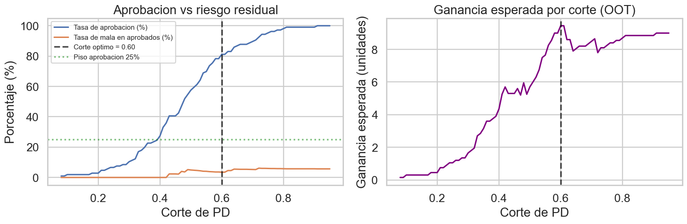
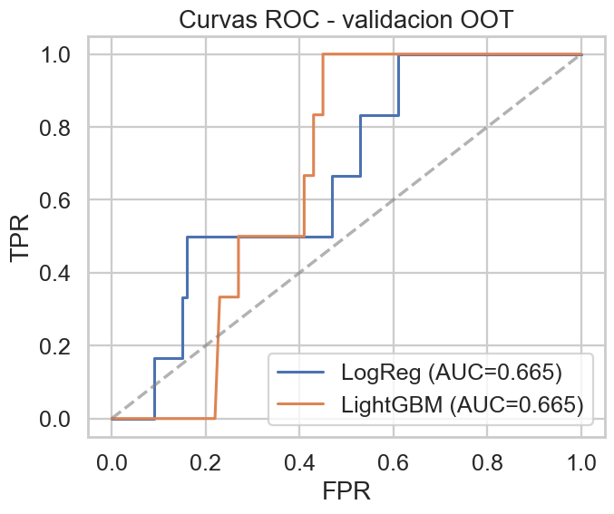
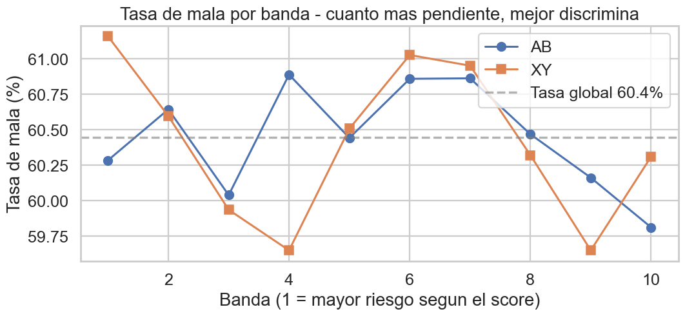
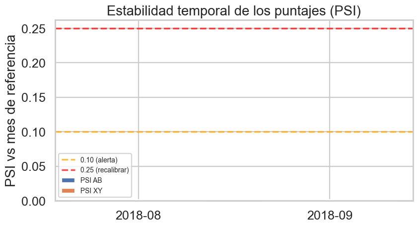

# Credit Risk Scorecard Evaluation

> Construcción de un modelo de **probability of default (PD)** para un producto crediticio dirigido a un segmento de **alto riesgo**, y evaluación comparativa de dos modelos de scoring proporcionados por proveedores externos.


---

## Contenido

- [Resumen del proyecto](#resumen-del-proyecto)
- [Hallazgos clave](#hallazgos-clave)
- [Estructura del repositorio](#estructura-del-repositorio)
- [Resultados visuales](#resultados-visuales)
- [Cómo reproducir](#cómo-reproducir)
- [Decisiones técnicas destacadas](#decisiones-técnicas-destacadas)
- [Limitaciones y próximos pasos](#limitaciones-y-próximos-pasos)

---

## Resumen del proyecto

El trabajo aborda dos preguntas de negocio en la cadena de **originación crediticia**:

1. **¿Cómo calificar clientes potenciales para un producto de alto riesgo?**
   Construir un modelo predictivo, definir la variable objetivo (mora a 30 vs 60 días), y fijar un punto de corte alineado con el costo real de incumplimiento y la viabilidad comercial.

2. **¿Cuál de dos modelos de scoring externos contratar?**
   Evaluar dos puntajes (proveedores AB y XY) sobre los cuatro ejes estándar de Riesgo: capacidad discriminante, estabilidad temporal, distribución de buenos/malos por banda y cobertura.

| Entregable | Archivo |
|---|---|
| Modelo predictivo (notebook ejecutado) | [`01_Modelo_ProductoNuevo.ipynb`](01_Modelo_ProductoNuevo.ipynb) |
| Evaluación de proveedores (notebook ejecutado) | [`02_Evaluacion_Proveedores.ipynb`](02_Evaluacion_Proveedores.ipynb) |
| Informe técnico ejecutivo | [`Informe_Tecnico Final.pdf`](Informe_Tecnico%20Final.pdf) |
| Presentación gerencial | [`Presentación Ejecutiva Final.pptx`](Presentaci%C3%B3n%20Ejecutiva%20Final.pptx) |

---

## Hallazgos clave

### Modelo de PD (punto 1)

- **Data leakage detectado** en la variable `MoraMax_UltimoSemestre`: el 100% de los clientes con `Mora60=1` cumplen `MoraMax ≥ 60`. La variable era prácticamente la definición lógica del target. **Excluida del modelo**, evitando un riesgo grave de producción.
- **Variable objetivo: Mora60**, mejor alineada con la definición operativa de default y con el costo real de incumplimiento en alto riesgo.
- **Modelo final: Regresión Logística** con `class_weight=balanced`, validada *out-of-time* (últimos 3 meses como hold-out).
  - Gini OOT ≈ 0.33 · KS OOT ≈ 0.39
- **Punto de corte recomendado: PD < 0.60**, derivado por maximización de ganancia esperada con piso de aprobación del 25% (viabilidad comercial), bajo asunción de costos asimétricos ~6.7×.

### Evaluación de proveedores (punto 2)

- **Ningún modelo discrimina materialmente** sobre la población: AUC ≈ 0.50 y KS < 0.01 en ambos.
- PSI mensual < 0.01 — son extremadamente estables, pero la estabilidad de un puntaje que no discrimina aporta poco valor.
- El proveedor XY no atiende al 11.2% de la base (12,800 clientes sin score).
- **Recomendación principal:** no contratar ninguno como está; pedir recalibración a los proveedores.
- **Si fuera obligatorio elegir:** AB, por cobertura del 100% y PSI ligeramente mejor.

---

## Estructura del repositorio

```
.
├── 01_Modelo_ProductoNuevo.ipynb        # Notebook punto 1 (ejecutado, con outputs)
├── 02_Evaluacion_Proveedores.ipynb      # Notebook punto 2 (ejecutado, con outputs)
├── utils.py                              # Funciones de scoring (KS, Gini, PSI, IV/WoE, decílica)
├── Informe_Tecnico Final.pdf            # Documento ejecutivo
├── Presentación Ejecutiva Final.pptx    # Presentación gerencial (10 slides)
│
├── figuras/                              # PNG generados por los notebooks
│   ├── 01_target_overview.png
│   ├── 01_roc_oot.png
│   ├── 01_ks_oot.png
│   ├── 01_corte_optimo.png
│   ├── 02_roc_proveedores.png
│   ├── 02_psi_proveedores.png
│   ├── 02_decilica_badrate.png
│   └── 02_curvas_ks.png
│
├── .gitignore
└── README.md
```

> **Nota.** Los archivos de datos crudos no se incluyen en el repositorio por confidencialidad. Las gráficas y los notebooks ejecutados muestran agregados suficientes para revisar la metodología y los resultados.

---

## Resultados visuales

### Punto de corte óptimo



> El corte recomendado (PD < 0.60) maximiza la ganancia esperada manteniendo un piso de aprobación del 25%.

### Curva ROC en muestra OOT



### Tasa de mala por banda de score (proveedores)



> Ambos modelos tienen tasa de mala plana en ~60% en todas las bandas — confirma visualmente la falta de capacidad discriminante.

### Estabilidad temporal de los puntajes (PSI)



---

## Cómo reproducir

### 1. Dependencias

```bash
pip install pandas numpy scikit-learn matplotlib seaborn lightgbm openpyxl jupyter
```

### 2. Datos

Los archivos `.xlsx` originales no se incluyen. Para una réplica completa habría que colocarlos en el directorio padre del repositorio:

```
..
├── ProductoNuevo.xlsx          ← (no incluido en el repo)
├── ModelosCompetencia.xlsx     ← (no incluido en el repo)
└── este_repo/
```

### 3. Re-ejecutar notebooks

```bash
python -m jupyter nbconvert --to notebook --execute 01_Modelo_ProductoNuevo.ipynb --output 01_Modelo_ProductoNuevo.ipynb
python -m jupyter nbconvert --to notebook --execute 02_Evaluacion_Proveedores.ipynb --output 02_Evaluacion_Proveedores.ipynb
```

---

## Decisiones técnicas destacadas

| Decisión | Justificación |
|---|---|
| **Mora60 sobre Mora30** | Mejor alineada con default operativo, costo del FN más alto, IV agregado comparable contra ambos targets. |
| **Excluir `MoraMax_UltimoSemestre`** | Data leakage detectado por crosstabs; sin esto el modelo daba KS=1.0 ficticio. |
| **Validación out-of-time** | Simula despliegue real; un split aleatorio sería optimista. |
| **Logística como modelo final** | Estándar regulatorio en credit scoring, interpretable, scorecard directa. LightGBM se mantiene como challenger. |
| **`class_weight=balanced`** | Maneja desbalance ~12% sin inventar datos sintéticos (vs. SMOTE). |
| **Punto de corte por costo/beneficio** | Refleja asimetría real: aprobar un malo cuesta ~6.7× lo que se gana con un bueno. Piso de 25% por viabilidad de negocio. |
| **PSI con cortes-quantil sobre referencia** | Más robusto que cortes uniformes para distribuciones de score. |
| **`utils.py` separado** | Consistencia entre notebooks: misma definición de KS/PSI/decílica en ambos. |

---

## Limitaciones y próximos pasos

**Limitaciones reconocidas:**

- Volumen de modelado relativamente bajo (~4,000 registros, ~500 malos en Mora60) → intervalo de confianza de las métricas amplio.
- Período de un solo año → no captura ciclos macroeconómicos.
- Sin scores de buró ni variables transaccionales → cota superior del Gini limitada.
- Las asunciones del corte (LOSS_BAD=1.00, GAIN_GOOD=0.15) deben validarse con el equipo financiero.

**Próximos pasos sugeridos:**

1. Validar costos con Finanzas y volumen objetivo con Negocio.
2. Implementar dashboard de monitoreo mensual (KS, PSI, tasa de aprobación, tasa de mala observada).
3. Pedir a los proveedores recalibración sobre población análoga al segmento objetivo.
4. Evaluar fuentes alternativas: buró tradicional, transaccional propio.
5. Reentrenamiento del modelo cada 6 meses o cuando PSI > 0.25.
